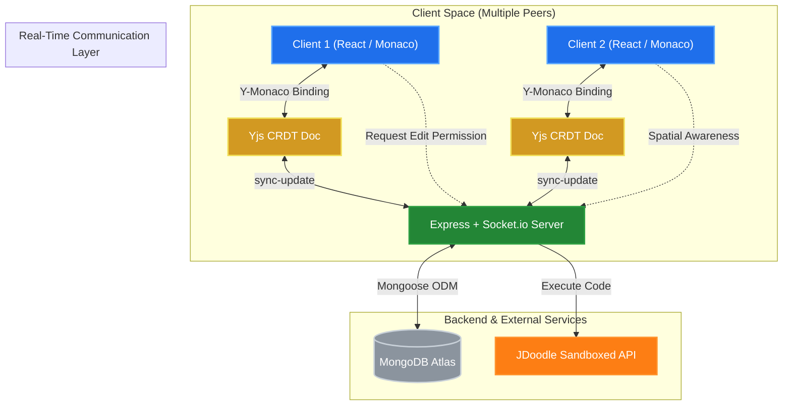

<div align="center">
  <h1>CollabCode</h1>
  <p><strong>Low-Latency Collaborative Code Editor with Distributed CRDT Synchronization</strong></p>

  <p>
    <a href="https://collabcode-ash.vercel.app"></a>
    <a href="https://github.com/ashcodes2/CollabCode"></a>
    
    
  </p>
</div>

---

## ⚡ Overview

**CollabCode** is a distributed real-time collaborative IDE designed to support multi-user code editing with zero synchronization conflicts. Built on top of **Yjs (CRDT)** and **Socket.io**, the platform provides real-time character-by-character synchronization, remote cursor presence, admin-controlled permission gates, and isolated multi-language code execution.

---

## 🛠️ Key Architectural Highlights

* **Conflict-Free State Sync (Yjs CRDT):** Resolves concurrent mutations deterministically without centralized operational transforms (OT), ensuring immediate local rendering and eventual state convergence.
* **Low-Latency WebSockets:** Powered by Socket.io to stream binary state vector updates between active peers and relay room events.
* **Monaco Editor Integration:** Embedded VS Code editor experience with syntax highlighting, auto-complete, multi-cursor awareness, and shared file system navigation.
* **Sandboxed Code Execution:** Integrated execution pipeline supporting multiple programming runtimes via compiler endpoints with live stdout/stderr capture.
* **Access Control & Security:** Granular room permissions (Admin/Guest) allowing room hosts to toggle live write-access on the fly, backed by JWT-authenticated user sessions.

---

## 🏗️ System Architecture & Data Flow



---

## 💻 Tech Stack

* **Frontend:** React.js, Vite, Monaco Editor, Tailwind CSS, Yjs, y-monaco
* **Backend:** Node.js, Express.js, Socket.io, JWT Authentication, bcrypt
* **Database:** MongoDB Atlas, Mongoose ODM
* **Execution & Infra:** JDoodle Sandboxed API, Vercel, Railway

---

## 📂 Repository Layout

```text
├── client/                     # Front-end React Application
│   ├── src/                    # Components, Monaco hooks, Socket providers
│   ├── public/                 # Static assets
│   ├── .env.example            # Client configuration keys
│   └── package.json
├── server/                     # Back-end Node/Express Server
│   ├── models/                 # Mongoose Schemas (User, Project, Room)
│   ├── routes/                 # Auth, Project persistence, Code execution APIs
│   ├── server.js               # Express & Socket.io server entry point
│   ├── .env.example            # Environment variables template
│   └── package.json
└── README.md
```

---

## 🚀 Local Development Setup

### 1. Clone Repository
```bash
git clone https://github.com/ashcodes2/CollabCode.git
cd CollabCode
```

### 2. Backend Setup
```bash
cd server
npm install
cp .env.example .env
npm run dev
```

### 3. Frontend Setup
```bash
cd ../client
npm install
cp .env.example .env
npm run dev
```

The application will run locally at `http://localhost:5173`.
